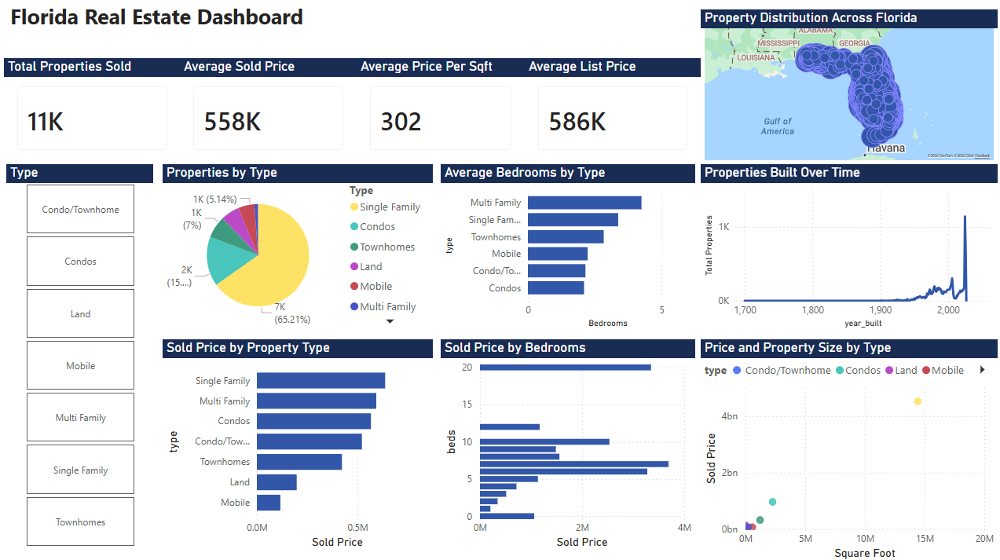

# Florida Real Estate Dashboard

A Power BI dashboard analyzing 10,893 sold properties across Florida in 2026.

## Dashboard

## Tools Used
- Power BI
- DAX
- Power Query

## Key Features
- KPI cards showing total properties, average sold price and price per sqft
- Interactive slicer to filter by property type
- Florida map showing property distribution by zip code
- Pricing analysis by property type and bedrooms
- Property trends over time

## Dataset
Florida Real Estate Sold Properties 2026 (Kaggle)
